# Data Science & Analytics — Mid-Term + End-Term (Excel → SQL → Power BI)

Unified documentation for **Phase 1 (mid-term)** and **Phase 2 (end-term)** of an AICTE-linked **Data Science & Analytics** internship (**INNOVATE BY HEXAIND**).

---

## At a glance

| Phase | When (typical) | Stack | Dataset scale | Core question |
|-------|----------------|-------|---------------|----------------|
| **Mid-term** | Early internship | **Excel** | ~**1,000** leads | Why does the **EV sales funnel** leak, and why is **NPS** so negative? |
| **End-term** | Later internship | **MySQL + Power BI** | **100k+** orders, 9 tables | How does a **Brazilian e-commerce** marketplace perform on **revenue, retention, sellers, payments, reviews, supply chain**? |

---

## Detailed docs

- **[README_MIDTERM.md](https://github.com/nikhilkr16/MAJORPRESENTATION_INTERNSHIP/tree/main/Mid_Term)** — EV funnel, Excel methodology, KPIs, confidentiality  
- **[README_ENDTERM.md](https://github.com/nikhilkr16/MAJORPRESENTATION_INTERNSHIP/tree/main/End_Term)** — SQL framework, Power BI, seven dimensions, supply chain queries  

---

## Phase 1 — Mid-term (EV retail, Excel)

**Funnel:** Lead Generation → Pre-Booking → Booking → Delivery  

**Sample KPIs (from analysis):**

| Metric | Value |
|--------|--------|
| Conversion (delivered / leads) | **72.9%** |
| Cancellation rate | **27.1%** |
| Avg TAT (lead → delivery) | **10.6 days** |
| NPS | **−53.5** |

### Figures

> **GitHub:** commit the PNGs under `images/` in this repo (same filenames as below) so the images render on the main README.

#### Lead-to-delivery funnel

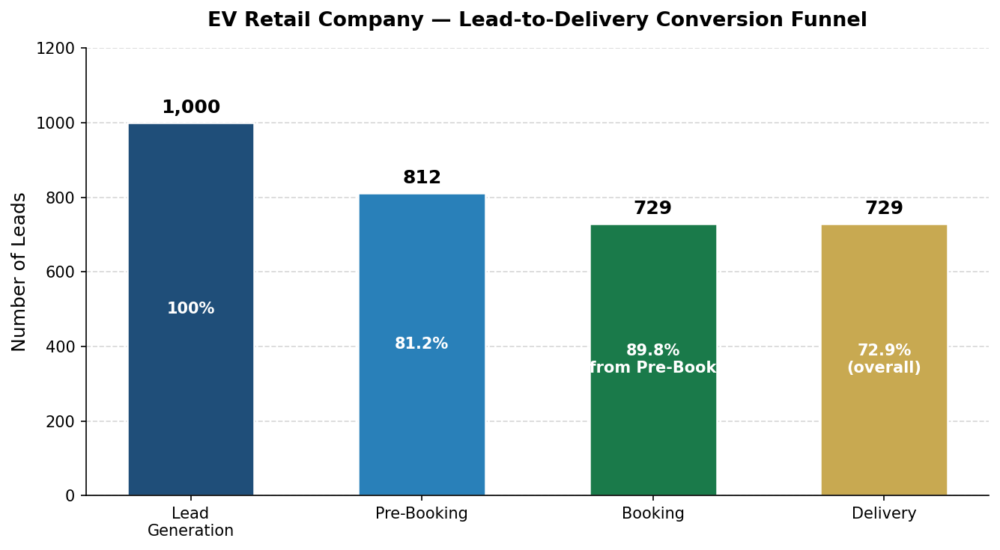

#### Store conversion vs NPS

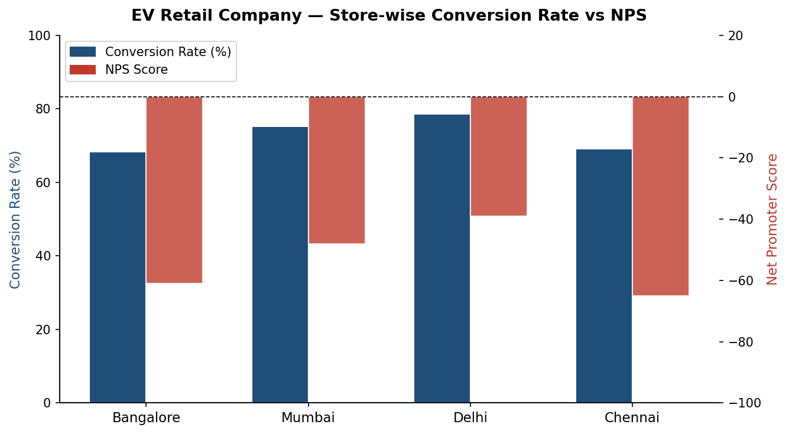

#### Cancellation reasons (Pareto)

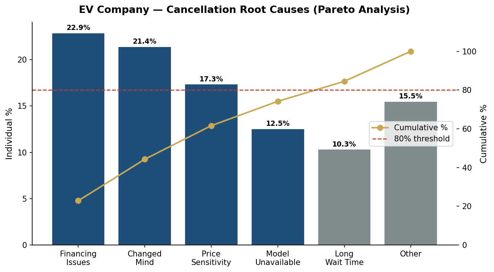

#### NPS breakdown

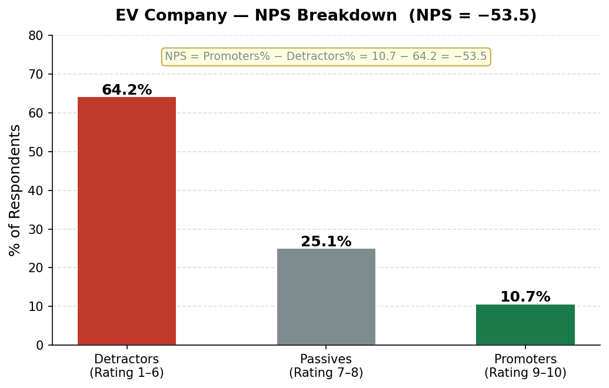

#### Stage-wise TAT vs SLA target

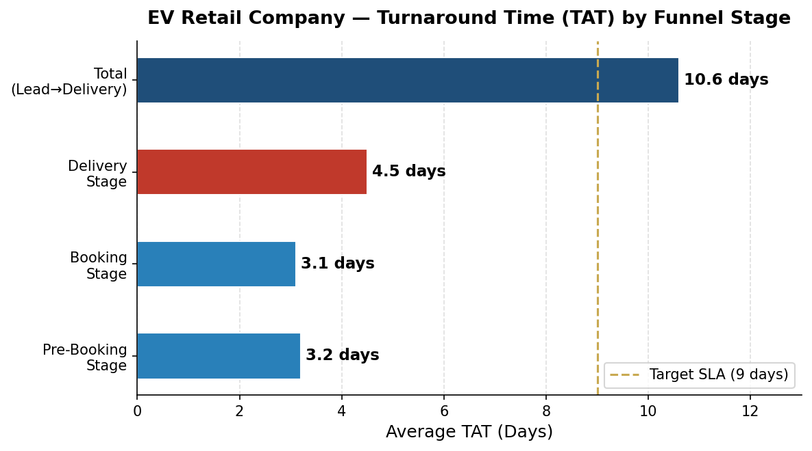

---

## Phase 2 — End-term (Brazilian e-commerce, SQL + Power BI)

 
**Seven analytical dimensions:** Orders & Revenue · Customers · Products & Categories · Sellers · Payments · Satisfaction · **Supply Chain**

**Sample themes:** near **single-purchase** behaviour, **~12–13 day** delivery averages, **late delivery** share, payment mix, seller/review dispersion.

### Figures

#### Monthly orders & revenue trend

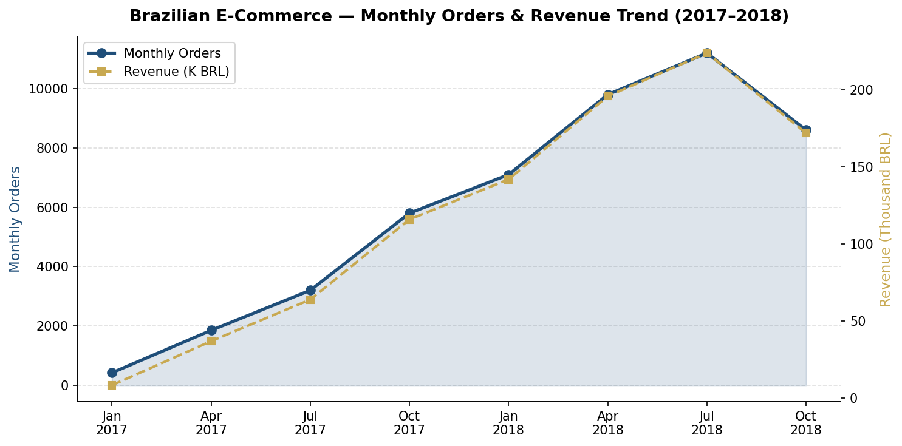

#### Customer purchase frequency

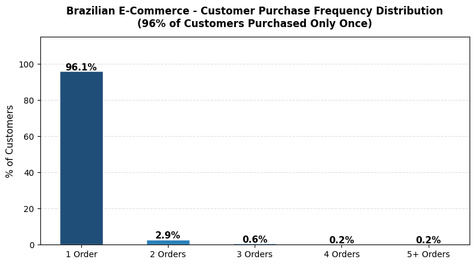

#### Top categories by volume

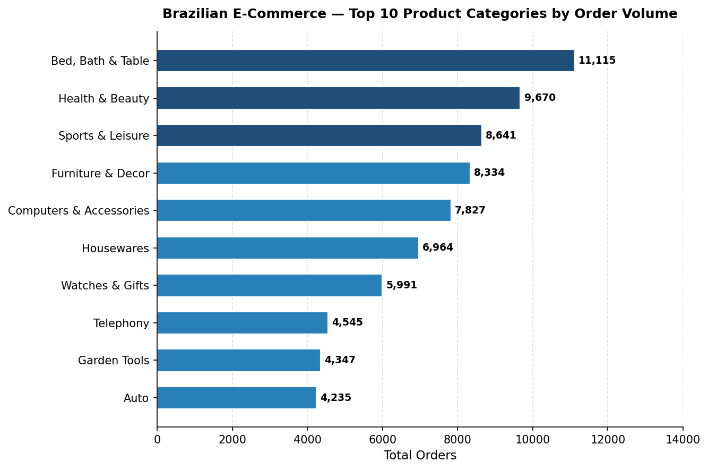

#### Payment method mix

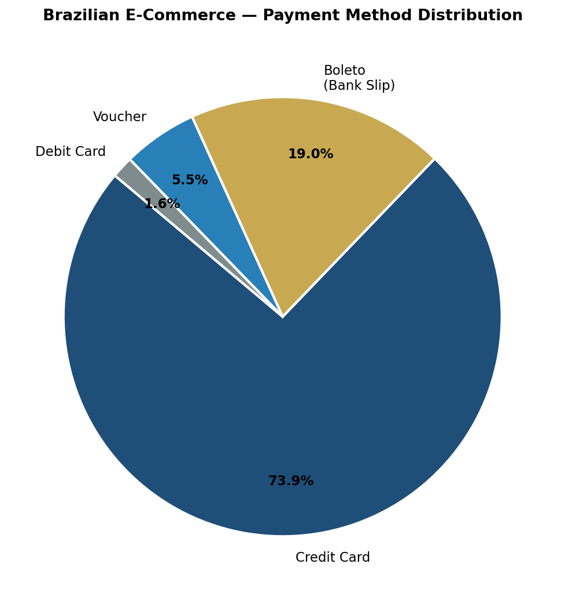

#### Review score distribution

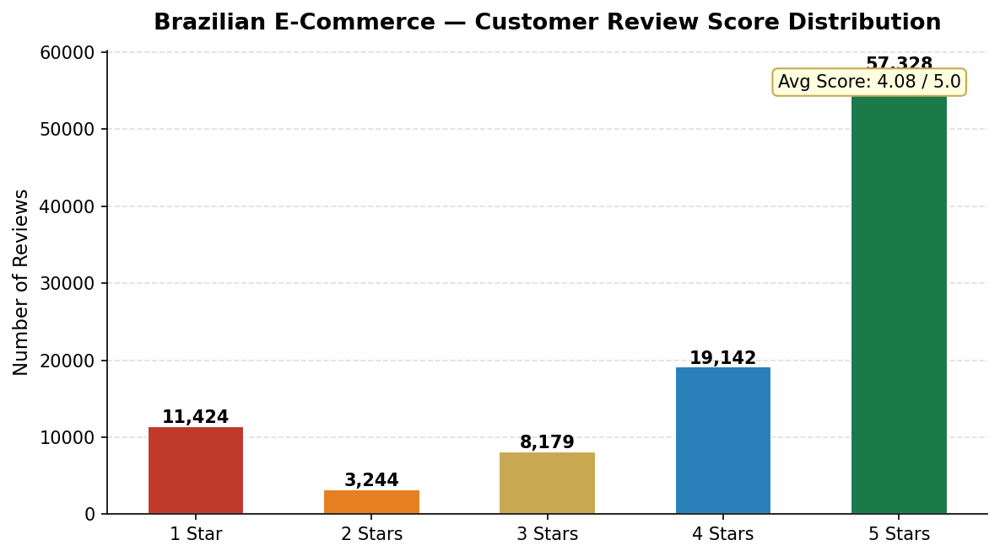

#### On-time vs late delivery

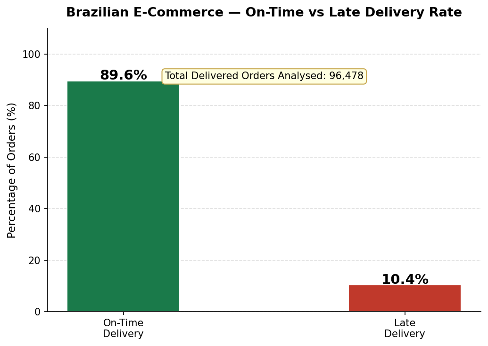

#### Delivery TAT by region (sample visual)

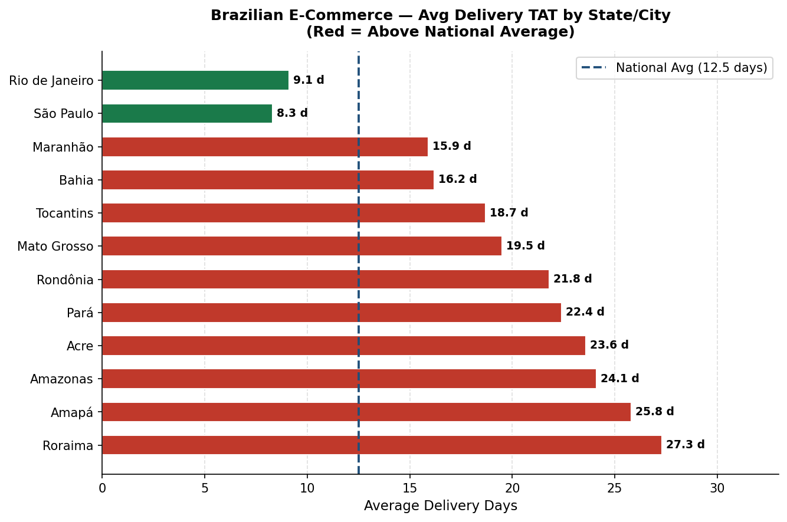

#### Seller performance (revenue vs rating)

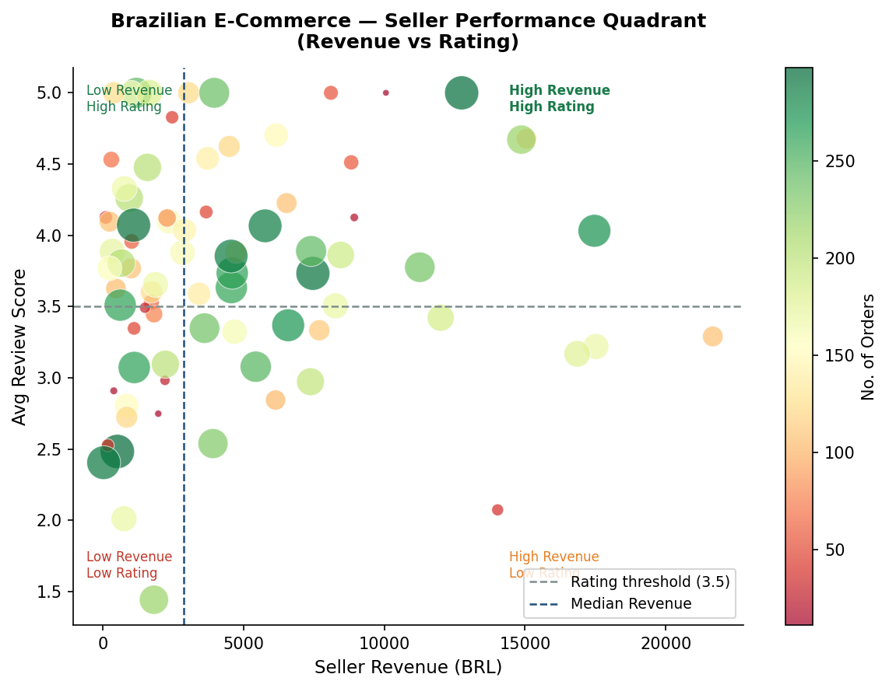

---

## Tech stack

`Microsoft Excel` · `MySQL` · `Microsoft Power BI` · `Git` / GitHub  

 

 
